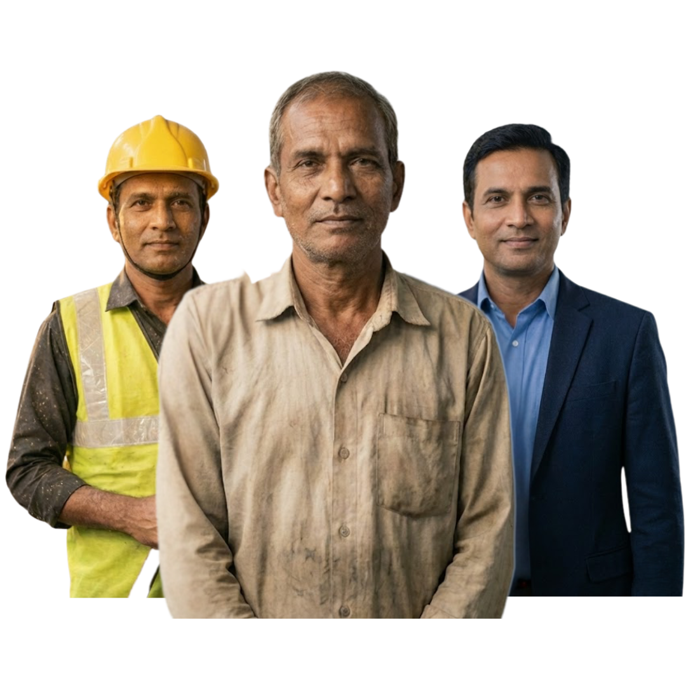
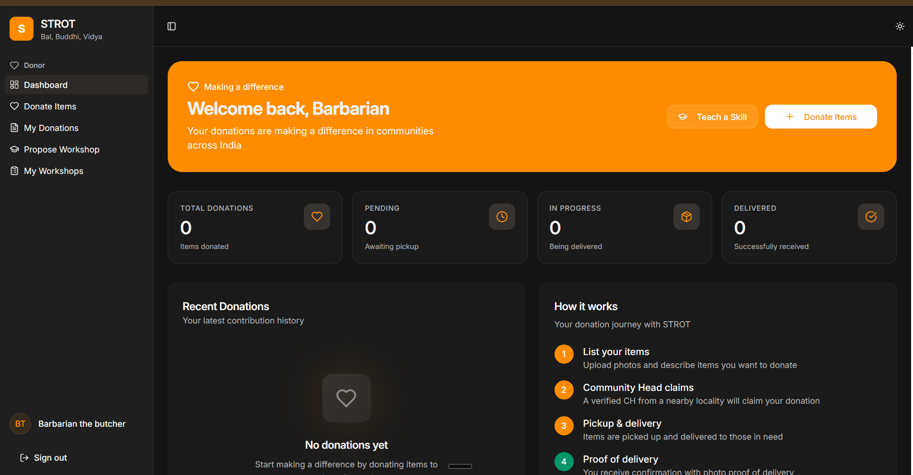
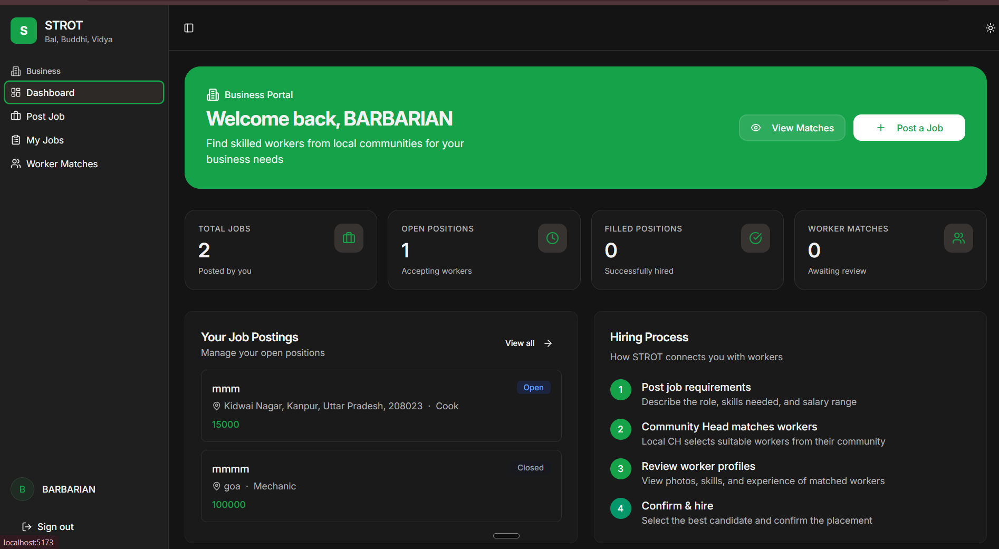
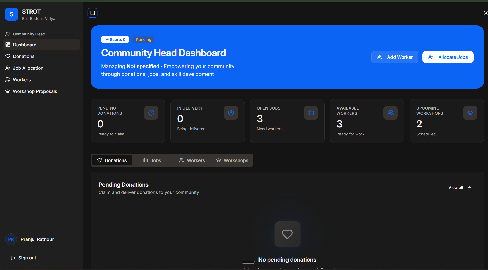
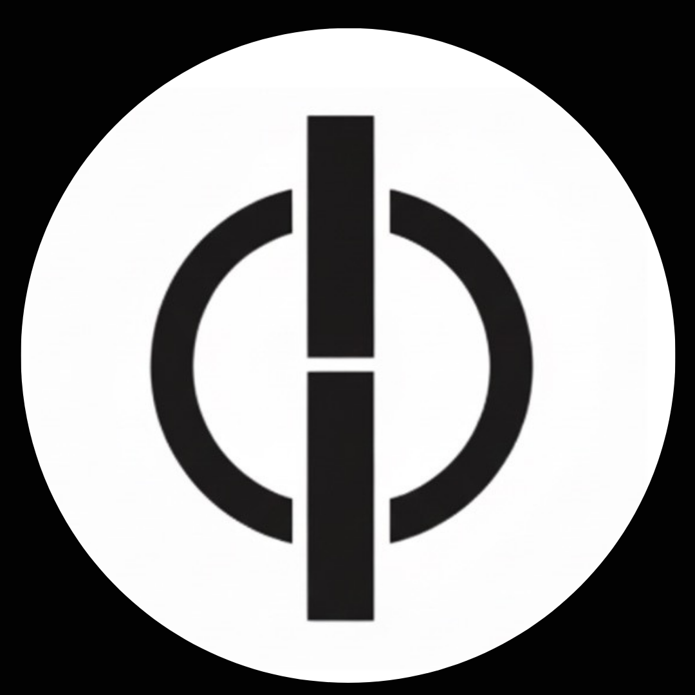

<p align="center">
  
</p>

<h1 align="center">STROT</h1>

<p align="center">
  <strong>"The platform that gives Bal, Buddhi, and Vidya"</strong><br>
  A transformative socio-economic upliftment platform for India
</p>

<p align="center">
  
  
  
  
  
</p>

---

## 📖 Overview

**STROT** is an integrated social platform designed to uplift slum communities across India through a structured ecosystem of donations, employment, and skill development. The platform breaks generational poverty using a transformative ladder approach:

<p align="center">
  <strong>BAL ➝ BUDDHI ➝ VIDYA ➝ UPLIFTMENT</strong>
</p>

<p align="center">
  
</p>

---

## 🎯 Vision

To create a **self-sustaining upliftment ecosystem** where:

- ✅ **Donors** give responsibly with full transparency
- ✅ **Businesses** get reliable, verified workers
- ✅ **Slum communities** receive genuine opportunities
- ✅ **Education** unlocks long-term transformation

STROT focuses on **minimal friction**, **high transparency**, and **community-driven governance**.

---

## 🏛️ Three Pillars

<table>
  <tr>
    <td align="center" width="33%">
      <br>
      <h3>BAL</h3>
      <strong>Donation Module</strong><br>
      <em>Basic Necessities</em>
      <p>Ensures delivery of food, clothes, and utilities to communities in need through verified Community Heads.</p>
    </td>
    <td align="center" width="33%">
      <br>
      <h3>BUDDHI</h3>
      <strong>Employment Module</strong><br>
      <em>Job Opportunities</em>
      <p>Creates verified employment opportunities connecting skilled workers with businesses seeking reliable talent.</p>
    </td>
    <td align="center" width="33%">
      <br>
      <h3>VIDYA</h3>
      <strong>Upskilling Module</strong><br>
      <em>Skill Development</em>
      <p>Long-term skill development through workshops, professionals, and certified instructors.</p>
    </td>
  </tr>
</table>

---

## 👥 User Roles

### 🏘️ Community Head (CH)
The operational backbone of STROT for each locality.
- Manage donations and coordinate deliveries
- Identify and register skilled workers
- Approve workshops and training programs
- Coordinate job matching between businesses and workers

### 💝 Donor (User)
Any individual who wants to donate items.
- List items quickly with photos
- Track donation status and history
- Receive proof of delivery confirmation

### 🏢 Business / Job Provider
MSMEs, factories, stores, and agencies.
- Post job requirements with skill specifications
- Review matched worker profiles
- Hire trustworthy, verified workers

### 🔐 Admin (STROT Organization)
Platform administrators who control operations.
- Approve Community Heads
- Manage tenure and performance
- Enforce security and ethical guidelines

---

## 📱 Dashboard Previews

### User Dashboard (Donor)
<p align="center">
  
</p>

*Donors can track their contributions, view donation history, and monitor the delivery status of their items.*

### Business Dashboard
<p align="center">
  
</p>

*Businesses can post jobs, view worker matches, manage open positions, and track successful hires.*

### Community Head Dashboard
<p align="center">
  
</p>

*Community Heads manage donations, jobs, workers, and workshops for their localities through a unified dashboard.*

---

## 🛠️ Tech Stack

### Frontend
| Technology | Purpose |
|------------|---------|
| **React 18** | UI Framework |
| **TypeScript** | Type Safety |
| **Tailwind CSS** | Styling |
| **Vite** | Build Tool |
| **React Query** | Server State Management |
| **Wouter** | Routing |
| **Radix UI** | Accessible Components |
| **Framer Motion** | Animations |
| **Lucide React** | Icons |
| **Recharts** | Data Visualization |

### Backend
| Technology | Purpose |
|------------|---------|
| **Express.js** | API Server |
| **Supabase** | Auth, Database & Storage |
| **Drizzle ORM** | Database Operations |
| **PostgreSQL** | Database |
| **Passport.js** | Authentication |
| **Zod** | Validation |

---

## 📁 Project Structure

```
STROT/
├── client/                    # Frontend React application
│   ├── public/               # Static assets (images, icons)
│   │   ├── logo.png          # Main STROT logo
│   │   ├── bal.png           # BAL module logo
│   │   ├── buddhi.png        # BUDDHI module logo
│   │   ├── vidya.png         # VIDYA module logo
│   │   └── ...               # Dashboard previews
│   └── src/
│       ├── components/       # Reusable UI components
│       ├── hooks/            # Custom React hooks
│       ├── lib/              # Utilities and services
│       ├── pages/            # Page components
│       ├── App.tsx           # Main application component
│       └── main.tsx          # Entry point
├── server/                    # Backend Express server
│   ├── db.ts                 # Database connection
│   ├── index.ts              # Server entry point
│   ├── routes.ts             # API routes
│   ├── storage.ts            # Storage utilities
│   └── vite.ts               # Vite integration
├── shared/                    # Shared types and utilities
├── package.json              # Dependencies
├── tailwind.config.ts        # Tailwind configuration
├── vite.config.ts            # Vite configuration
└── drizzle.config.ts         # Drizzle ORM configuration
```

---

## 🚀 Getting Started

### Prerequisites

- **Node.js** 18+ 
- **npm** or **yarn**
- **PostgreSQL** database (or Supabase account)

### Installation

1. **Clone the repository**
   ```bash
   git clone https://github.com/Pranjulrathour/strot.in.git
   cd strot
   ```

2. **Install dependencies**
   ```bash
   npm install
   ```

3. **Set up environment variables**
   
   Create a `.env` file in the root directory:
   ```env
   DATABASE_URL=your_database_url
   SUPABASE_URL=your_supabase_url
   SUPABASE_ANON_KEY=your_supabase_anon_key
   SESSION_SECRET=your_session_secret
   ```

4. **Push database schema**
   ```bash
   npm run db:push
   ```

5. **Start development server**
   ```bash
   npm run dev
   ```

6. **Open in browser**
   ```
   http://localhost:5173
   ```

---

## 📜 Available Scripts

| Command | Description |
|---------|-------------|
| `npm run dev` | Start development server |
| `npm run build` | Build for production |
| `npm run start` | Preview production build |
| `npm run check` | Run TypeScript type checking |
| `npm run db:push` | Push database schema changes |

---

## 🔄 User Flows

### 📦 Donation Flow (BAL)
1. User logs in and clicks **Donate**
2. Uploads item images and selects category
3. Chooses locality or lets CH pick
4. Community Head receives notification
5. CH claims and picks up item
6. CH delivers and uploads proof photo
7. Donor sees status as **Delivered**

### 💼 Employment Flow (BUDDHI)
1. Business signs up and posts job requirements
2. Community Head receives notification
3. CH selects matching workers from community
4. Sends worker profiles to business
5. Business reviews, selects, and confirms hire
6. Commission invoice auto-generates
7. Placement is recorded

### 📚 Upskilling Flow (VIDYA)
1. Instructor/NGO applies to host workshop
2. Community Head reviews and approves
3. Workshop is scheduled
4. Attendance is tracked
5. Skill records are updated for participants

---

## 🔐 Security & Privacy

- **Row-Level Security (RLS)** on all database tables
- **Protected identity** of slum residents
- **Masked phone numbers** for privacy
- **Child safety filters** implemented
- **Corruption prevention** through audit logs
- **GDPR-compliant** data deletion on request

---

## 📊 Key Performance Indicators

### Community Head Metrics
- Donations delivered
- Workers successfully placed
- Workshops approved
- Community rating score

### Business Metrics
- Time to hire
- Quality of hire rating
- Successful placements

### Platform Metrics
- Active localities
- Items donated
- Jobs created
- Skill hours delivered

---

## 🎨 Design Philosophy

STROT follows **Apple-like minimalism** with:
- Clean white backgrounds with soft grey gradients
- Rounded corners (10-14px)
- Ample spacing and breathing room
- San-serif fonts (Inter, SF Pro)
- Subtle drop shadows
- Muted, accessible color palette
- Mobile-first responsive design
- Skeleton loaders for dynamic content
- Card-based layouts

---

## 🤝 Contributing

We welcome contributions! Please follow these steps:

1. Fork the repository
2. Create a feature branch (`git checkout -b feature/amazing-feature`)
3. Commit your changes (`git commit -m 'Add amazing feature'`)
4. Push to the branch (`git push origin feature/amazing-feature`)
5. Open a Pull Request

---

## 📄 License

This project is licensed under the **MIT License** - see the [LICENSE](LICENSE) file for details.

---

## 🙏 Acknowledgments

- Built with ❤️ for the communities of India
- Designed for maximum social impact with minimal friction
- Optimized for low-end devices and 4G networks

---

<p align="center">
  
</p>

<p align="center">
  <strong>STROT</strong> - Empowering Communities, One Step at a Time<br>
  <em>Bal • Buddhi • Vidya</em>
</p>
